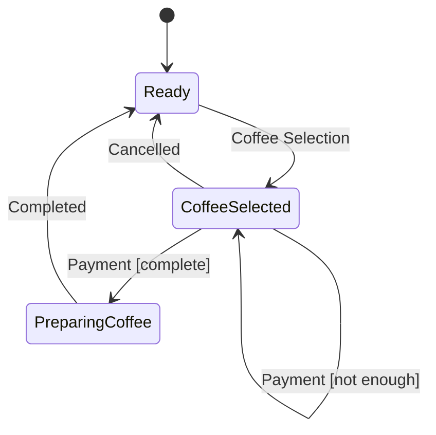

# Scala 3 Bits and Pieces

## Effects

### In Essence, What are Effect Types like IO About?

**But what is a side effect in computer programs in the first place?** Every computation that isn't a pure function call
is effectful, that is, every function call that cannot be memoized or, in other words, whose result cannot
be stored in favor of calling the function again, e.g. `readChar()`.

All real-world programs are full of effects: taking user input, writing stuff into
the database, locking a shared resource, creating a timestamp, waiting for an asynchronous
computation to complete, and so on and so forth.

**By deferring the execution of an effectful computation,
effect types allow us to compose complex effects from simpler ones in a pure functional way,
just like we can compose complex pure functions from simpler ones.**

At the very core of any effect system (e.g. monix, cats-effect or zio) there's a higher kinded type like `IO[_]`
- to wrap and defer the execution of an effectful computation: `unit` 
- to modify the result of the computation with a pure function: `map`
- to compose effectful computations to more complex ones: `flatMap`
- and to finally run the (composed) computation: `unsafeRun`

```scala 3
class IO[A](val unsafeRun: () => A):

  def map[B](f: A => B): IO[B] = IO:
    () => f(unsafeRun())

  def flatMap[B](f: A => IO[B]): IO[B] = IO:
    () => f(unsafeRun()).unsafeRun()

object IO:

  def unit[A](a: => A): IO[A] = IO:
    () => a
```

As a result, an instance of the effect type `IO[A]` can represent an HTTP request,
accessing a locked resource, an asynchronous computation, a database transaction, you name it.

Of course, the effect system that ultimately implements
the effect type and runs the effect is much richer than this implementation. 
It will provide convenience methods and predefined effects that'll make development easier. 
For example, it will allow means to run effects in parallel, cancel effects or handle errors.

In the code examples in [`org.sanssushi.sandbox.effects.Effects`](src/main/scala/org/sanssushi/sandbox/effects/Effects.scala) I use a generic effect type `F[_]`
to focus on the abstract structure and to remove the specifics of concrete effect
types as much as possible (and that way the code can run on different effect systems.)

As demonstration of the usefulness and relative simplicity of effect composition, 
I implemented a [Semaphore](https://en.wikipedia.org/wiki/Semaphore_(programming))
composed of simpler effects. The equivalent cats-effect version
of the simple effects there are referenced in the scaladoc, if available.
Some common effects and utils are put into [`org.sanssushi.sandbox.effects.F`](src/main/scala/org/sanssushi/sandbox/effects/F.scala).
A demo use case (controlled concurrent file access) can be found
in [`org.sanssushi.sandbox.effects.Main`](src/main/scala/org/sanssushi/sandbox/effects/Main.scala) and some
test cases are covered in [`org.sanssushi.sandbox.effects.Test`](src/test/scala/org/sanssushi/sandbox/effects/Test.scala).

## State


