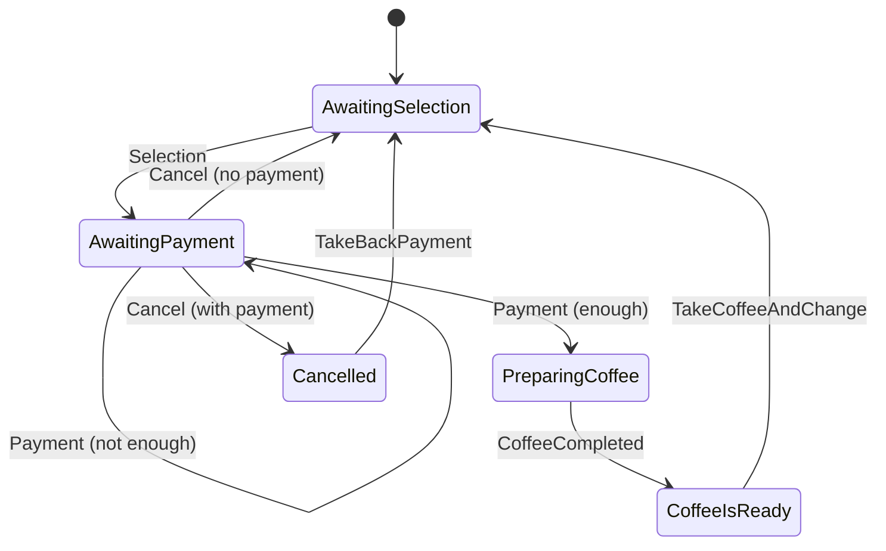

# Scala 3 Bits and Pieces

## Effects

### In Essence, What are Effect Types like IO[_] About?

But first, what is an effect in computer programs? Every computation that isn't a pure function call
is effectful, that is, every function call that cannot be memoized or, in other words, whose result cannot
be stored in favor of calling the function again, e.g., `readChar()`.

All real-world programs are full of effects: taking user input, writing stuff into
the database, locking a shared resource, creating a timestamp, waiting for an asynchronous
computation to complete, and so on and so forth.

**By deferring the execution of an effectful computation and wrapping it in a monadic structure,
effect types allow us to compose complex effects from simpler ones in a pure functional way,
just like we can compose complex pure functions from simple ones.**

As a result, an instance of the effect type `IO[A]` can represent an HTTP request,
accessing a locked resource, an asynchronous computation, a database transaction, you name it.

Of course, the effect system (monix, cats-effect, zio, ...) that ultimately implements
the effect type and runs the effect will provide many convenience methods and
predefined effects that'll make development easier. But the use of a generic effect type `F[_]`
allows us to focus on the abstract structure and remove the specifics of concrete effect
types as much as possible (plus that way the code will run on different effect systems.)

As demonstration of the usefulness and relative simplicity of effect composition, 
you find an implementation of [Semaphore](https://en.wikipedia.org/wiki/Semaphore_(programming))
composed of simpler effects in `Effects.scala`.  The equivalent cats-effect version
of simple effects written there are referenced in the scaladoc, if available.
Some common effects and utils are put into object `F`.
A demo use case (controlled concurrent file access) can be found in `Main`. Some
test cases are covered in `Test`.

